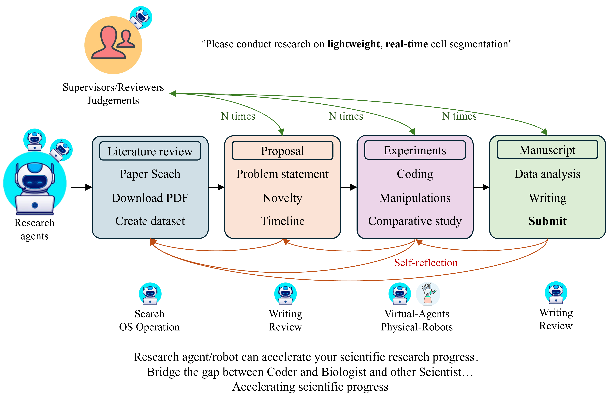

# Auto-Research
Autonomous Generalist Scientist: Towards and Beyond Human-level Automatic Research Using Foundation Model-Based AI Agents and Robots

## Overview

The Autonomous Generalist Scientist （AI Scientist） project aims to revolutionize the academic research process by introducing a framework for fully automated research agents/robots. This initiative seeks to integrate artificial intelligence into every stage of research—from literature reviews to proposal, experiment, writing, submitting, reviewing manuscripts. Our vision is to facilitate a seamless research workflow that enhances productivity and fosters innovation in scientific inquiry. Here’s how we envision the integration of automated agents and robotics evolving within the framework:

Phase 1: Software-Only Agents
Initially, the project will focus on software-only agents that can perform tasks not requiring physical interaction with the real world. 

Phase 2: Integration of Robotics
As the project matures and the capabilities of our agents evolve, we plan to introduce robotics to carry out physical tasks and experiments in the laboratory. 

<p align="center">
  
  <br>
  <em>Auto Research Agents framework and vision</em>
</p>


## Directory Structure

- `gscientist/`: The main directory housing all the components of Nova.
  - `core/`: System management.
  - `agents/`: Contains the agent implementations with `agent.py` serving as a template or a particular instance.
  - `communication/`: Contains the ros like communication mechanism.  
  - `llm/`: Dedicated to language model functionality, where `llm.py` defines language model-related operations.
  - `tools/`: A suite of utility scripts to augment the functionality of agents.
    - `builtins/`: Essential tools that come with the Nova framework.
    - `plugins/`: Dynamically loaded modules that extend the capabilities of Nova agents.
- `ui/`: User interface assets that define how users interact with the Nova framework.
  - `frontend/`: Web ui.
  - `qt/`:  The graphical user interface components built with PyQt or PySide6 for user interaction.

## Getting Started

Todo: Instructions on how to set up the environment, install dependencies, and run the initial configuration.

## Contribution

To make a contribution or suggest an idea to this project.

* [Discord server](https://discord.gg/fc2MtCmd)

* [Outline-Google doc](https://docs.google.com/document/d/1fgZlbtTNTKPP3TpHL5X6xJlBxpIoKeellfeJn-V7zSA/edit?usp=sharing)


## Star History

[](https://star-history.com/#universea/Auto-Research&Date)

## Citation
```
bibtex
@misc{auto-research,
  title        = {Autonomous Generalist Scientist: Towards and Beyond Human-level Automatic Research Using Foundation Model-Based AI Agents and Robots (A Position)},
  author       = {Starkson Zhang, Alfredo Pearson, Zhenting Wang, Welcome Coauthors},
  year         = {2024},
  journal      = {DOI: 10.13140/RG.2.2.35148.01923},
}
```