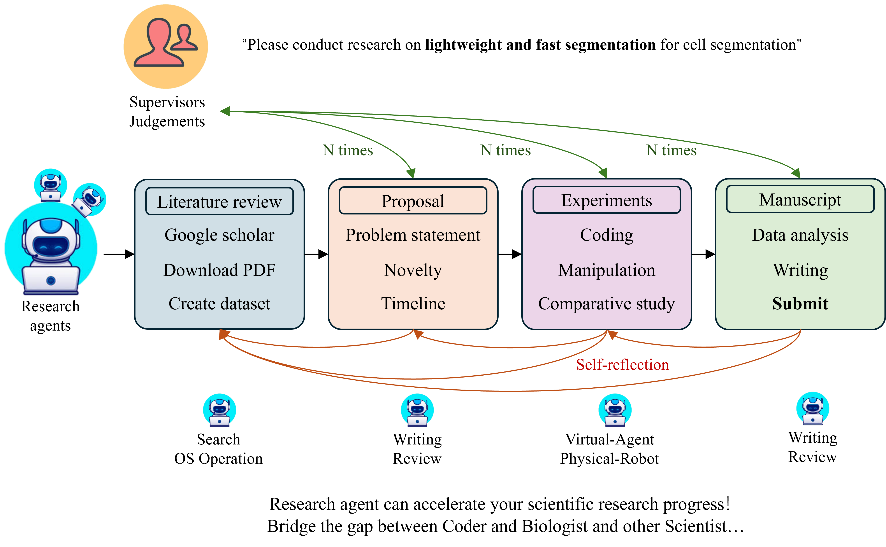

# Auto-Research
Towards fully automatic research agents framework


## Overview

The Auto-Research project aims to revolutionize the academic research process by introducing a framework for fully automated research agents. This initiative seeks to integrate artificial intelligence into every stage of research—from literature reviews to proposal, experiment, writing and submitting manuscripts. Our vision is to facilitate a seamless research workflow that enhances productivity and fosters innovation in scientific inquiry. Here’s how we envision the integration of automated agents and robotics evolving within the framework:

Phase 1: Software-Only Agents
Initially, the project will focus on software-only agents that can perform tasks not requiring physical interaction with the real world. 

Phase 2: Integration of Robotics
As the project matures and the capabilities of our agents evolve, we plan to introduce robotics to carry out physical tasks and experiments in the laboratory. 

<p align="center">
  
  <br>
  <em>Auto Research Agents framework and vision</em>
</p>


## Directory Structure

Todo


## Getting Started

Todo: Instructions on how to set up the Nova environment, install dependencies, and run the initial configuration.

## Contribution

To make a contribution or suggest an idea to this project.

* [Discord server](https://discord.gg/fc2MtCmd)

* [Outline-Google doc](https://docs.google.com/document/d/1fgZlbtTNTKPP3TpHL5X6xJlBxpIoKeellfeJn-V7zSA/edit?usp=sharing)


## Star History

[](https://star-history.com/#universea/Auto-Research&Date)

## Citation
```
bibtex
@misc{auto-research,
  title        = {Auto Research: Towards fully automatic research agents},
  author       = {Pengsong Zhang, Welcome Coauthors},
  year         = {2024},
  howpublished = {GitHub},
  url          = {https://github.com/universea/Auto-Research}
}
```